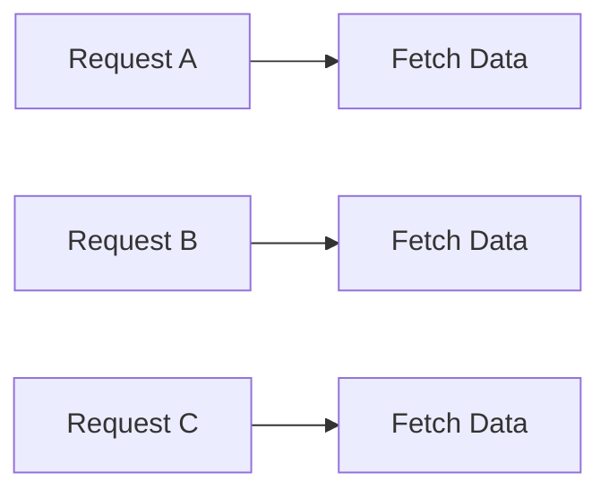
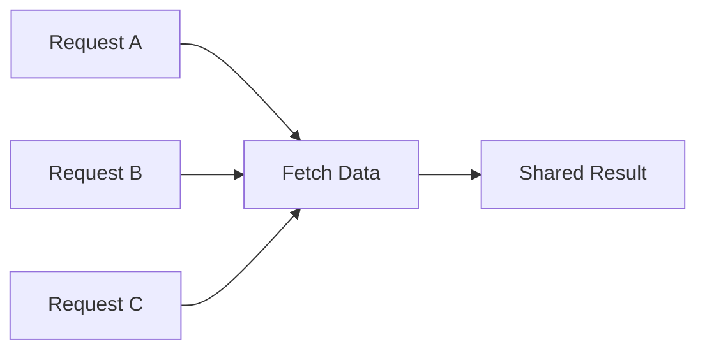
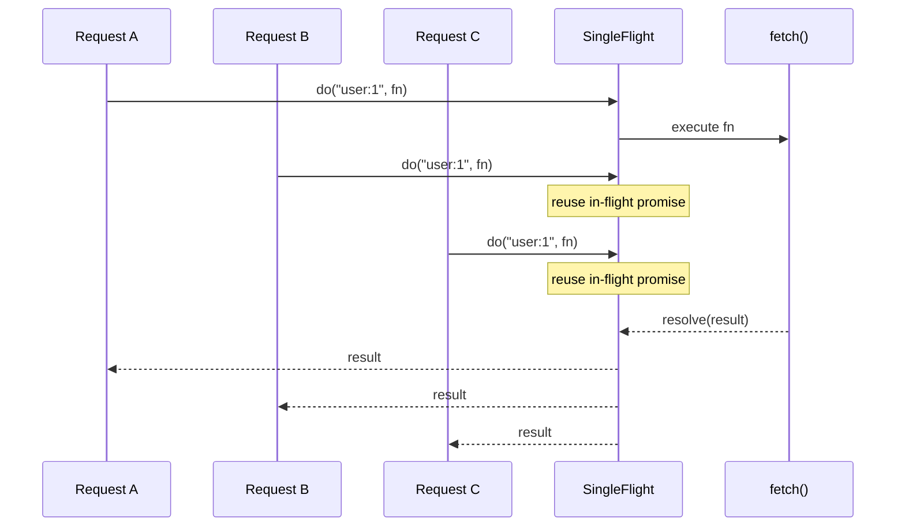
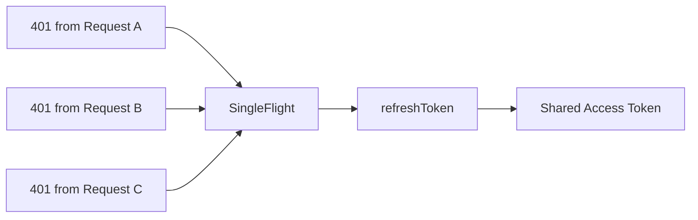

# p-singleflight

> Deduplicate concurrent async operations by sharing the same in-flight Promise

---

## Table of Contents

- [Introduction](#introduction)
- [Quick Example](#quick-example)
- [Installation](#installation)
- [What is SingleFlight?](#what-is-singleflight)
- [Problem](#problem)
- [Solution](#solution)
- [How Does SingleFlight Work?](#how-does-singleflight-work)
- [Real-world Example: Token Refresh](#real-world-example-token-refresh)
- [API](#api)
- [License](#license)

---

## Introduction

As developers, we often face situations where the same resource is requested multiple times at the same moment.

Without coordination, this leads to duplicate work:
multiple API calls, repeated database queries, and unnecessary load on services.

In Go, the [singleflight](https://pkg.go.dev/golang.org/x/sync/singleflight) package provides a simple and effective way to solve this by ensuring that only one execution is in-flight for a given key.

This library brings the same idea to JavaScript and TypeScript.

---

## Installation

```bash
npm install p-singleflight
```

```bash
pnpm add p-singleflight
```

```bash
yarn add p-singleflight
```

---

## Quick Example

```ts
import { SingleFlight } from 'p-singleflight';

const sf = new SingleFlight<string>();

async function fetchUser(id: string) {
  console.log('fetching...');
  return { id };
}

await Promise.all([
  sf.do('user:1', () => fetchUser('1')),
  sf.do('user:1', () => fetchUser('1')),
  sf.do('user:1', () => fetchUser('1')),
]);
```

```text
fetching... // only once
```

---

## What is SingleFlight?

SingleFlight is a concurrency pattern that ensures that only one execution of a given operation is in-flight at a time.

When multiple callers request the same resource concurrently:

- the function is executed only once
- all callers receive the same result

This pattern originated from Go’s [`singleflight`](https://pkg.go.dev/golang.org/x/sync/singleflight) package and is commonly used to eliminate duplicate work under concurrency.

---

## Problem

Without coordination, identical concurrent requests perform duplicate work.



### Issues

- Duplicate execution
- Increased backend load
- Waste of resources

This is often referred to as the thundering herd problem.

---

## Solution

SingleFlight groups concurrent calls by key and ensures that only one execution happens while all callers share the result.



### Result

- Only one execution
- Shared result across callers
- Reduced load and improved efficiency

---

## How Does SingleFlight Work?

The mechanics of SingleFlight are straightforward:

1. **First Call Initiation**: The first request triggers the execution of the function.

2. **Concurrent Request Handling**: Additional requests for the same key reuse the in-flight Promise.

3. **Result Sharing**: Once the execution completes, the result is returned to all callers.

4. **Duplication Prevention**: Only one execution occurs for a given key at a time.

### Internal Flow



---

## Real-world Example: Token Refresh

A common use case is token refresh deduplication.

When multiple requests fail with `401` at the same time:



### Without SingleFlight

- Multiple refresh requests are triggered
- Race conditions may occur
- Tokens may be overwritten

### With SingleFlight

```ts
await sf.do('auth:refresh', refreshAccessToken);
```

- Only one refresh request is executed
- All callers wait for the same result
- Race conditions are avoided

---

## API

### `do(key, fn)`

Execute a function with single-flight deduplication.

```ts
await sf.do(key, fn);
```

- Only one execution per key
- Other callers reuse the same Promise

### `wrap(fn, keyGetter)`

Wrap a function with automatic key derivation.

```ts
const getUser = sf.wrap(fetchUser, id => `user:${id}`);
await getUser('1');
```

### `forget(key)`

Remove in-flight tracking for a key.

```ts
sf.forget(key);
```

This does not cancel the underlying operation.

### `clear()`

Clear all in-flight entries.

```ts
sf.clear();
```

This does not cancel the underlying operation.

### `has(key)`

Check if a key is currently in-flight.

```ts
sf.has(key);
```

---

## License

[MIT](./LICENSE)
